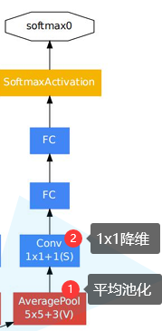
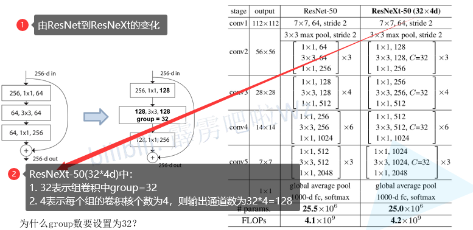

# Bilibili大学

## 基础知识

> Pytorch Tensor的通道顺序：`[batch, channel, height, width]`

### 网络的计算过程

BP(back propagation, **反向传播**)算法包括**信号的前向传播**和**误差的反向传播**两个过程。即计算误差输出时按从输入到输出的方向进行，
而调整权值和阈值则从输出到输入的方向进行。

- 
- 
- 
- 

权重的更新：
- 在实际应用中往往不可能一次性将所有数据载入内存，所以只能分批次(batch)训练
- **若使用整个样本集进行求解，损失梯度指向全局最优方向**
- **若使用批次样本进行求解，损失梯度指向当前批次最优方向**
- 

### 优化器optimizer

1. SGD优化器(Stochastic Gradient Descent, 随机梯度下降)
   - 
2. SGD+Momentum优化器
   - 
3. Adagrad优化器(自适应**学习率**)
   - 
   - s_t为梯度平方的累加值
   - 缺点：学习率下降太快，可能还没收敛就停止训练
4. RMSProp优化器(自适应优化器)
   - 
   - 在`Adagrad`基础上控制s_t值
5. `Adam`优化器(自适应学习率)
   - 

> 比较常见SGD+Momentum或Adam。SGD虽然慢，但可能是最优的

### 激活函数

**激活函数**:
- **引入非线性因素，使其具备解决非线性问题的能力**
- 
- 

### 卷积层

**卷积层**(Convolution)：
- 目的：进行图像**特征提取**
- 拥有**局部感知**机制
- **权值共享**，极大降低了参数量，便于模型训练

卷积操作：
- 
- **卷积核的channel与输入特征层的channel相同**
- **输出的特征矩阵channel与卷积核个数相同**

卷积操作过程中，矩阵经过卷积操作后的尺寸由以下几个因素决定：
1. 输入图片大小WxW
2. Filter大小FxF
3. 步长S
4. padding的像素数P

> 经过卷积后的矩阵尺寸大小计算公式：`N = (W - F + 2P)/S + 1`

### 池化层

目的：**对特征图进行稀疏处理，减少数据运算量**
**特点**：
- 没有训练参数
- 只改变特征矩阵的w和h，不改变channel
- 一般pool_size和stride相同

- MaxPooling下采样层
  - 
- AveragePooling下采样层
  - 

## Alex[2012]

### 网络亮点

1. 首次利用GPU进行网络加速训练
2. 使用了`ReLU`激活函数，而不是传统的`Sigmoid`激活函数以及`Tanh`激活函数
3. 使用了`LR`N局部相应归一化
4. 在全连接层的前两层中使用`Dropout`随机失活神经元操作，以减少过拟合

### 过拟合与Dropout

- 
- 使用 Dropout 的方式在网络正向传播过程中随机失活一部分神经元
  - 

## GoogLeNet[2014]

### 网络亮点

1. 引入了`Inception`结构，**融合不同尺度的特征信息**
2. 使用`1x1`的卷积核进行**降维**以及映射处理
3. 添加两个**辅助分类器**帮助训练
4. 丢弃全连接层，使用平均池化层，大大减少模型参数

### Inception结构

- 
- 
- 

### Auxiliary Classifier辅助分类器

- 

## ResNet[2015]

> Deep Residual Learning for Image Recognition

### 网络亮点

- 超深的网络结构(突破1000层)
- 提出 `residual` 模块
- 使用 `Batch Normalization` 加速训练(对齐dropout)
- 

### 问题提出

当网络深度增加时，训练/测试损失增加：
- 
- 梯度消失或梯度爆炸。如当损失梯度是小于1的数，反向传播根据链式法则梯度相乘会越来越小，梯度爆炸同理。
- 退化问题(degradation problem)。

### residual结构

- 
- `1*1`卷积核用来降维和升维，同时降低了参数量

ResNet-34:
- 
- 

## Batch Normalization

- BN的目的是使一批(Batch)的feature map满足均值为0，方差为1的分布规律
- 
- 具体地，是指输入模型的一批数据的某一通道满足零均值、单位方差分布
- 

### 使用BN时需要注意的问题

1. 训练时要将training设置为True，验证时将training参数设置为False。在pytorch中可通过创建模型的`model.train()`和`model.eval()`方法控制
2. **`batch_size`尽可能设置大点**，设置小后表现可能很糟糕，设置的值越大求的均值和方差越接近整个训练集的均值和方差
3. **建议将bn层放在卷积层(Conv)和激活曾(例如Relu之间)，且卷积层不要使用偏置bias**。因为没有用。

## 迁移学习

1. 能够快速地训练出一个理想的结果
2. 当数据集较小时也能训练出理想的效果
3. 注意：使用别人预训练模型参数时，要注意别人的预处理方式
4. 

### 常见的迁移学习方式

- 

## ResNeXt

> Aggregated Residual Transformations for Deep Neural Networks

- 

### 组卷积(Group Convolution)

- 
- 
- 
